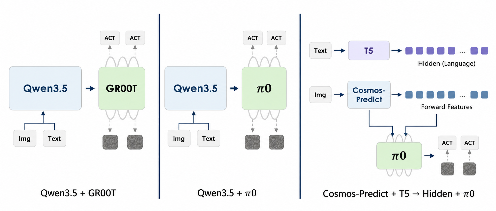
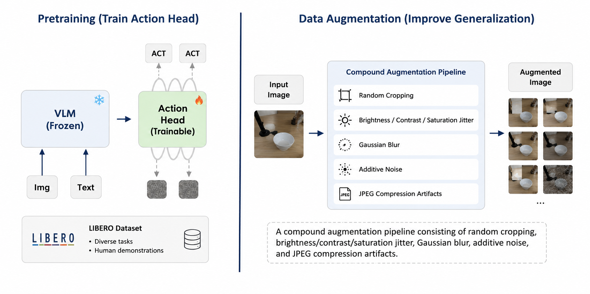

# StarVLA ABC-D

**An empirical VLA study for long-horizon manipulation on CALVIN ABC->D.**

This repository is our StarVLA-based implementation for studying how backbone choice, action-head design, data augmentation, pre-training, failure patterns, and progress-aware remedies affect long-horizon robot control under distribution shift.

<p align="center">
  <a href="https://cjgogo27.github.io/StarVLA_ABC_D/"><b>Project Page</b></a> |
  <a href="https://huggingface.co/cjgogo"><b>Hugging Face</b></a> |
  <a href="docs/CALVIN_ABC_D_REPORT.md"><b>Technical Report</b></a> |
  <a href="docs/CODE_OVERVIEW.md"><b>Code Overview</b></a> |
  <a href="file.md"><b>Paper Draft</b></a>
</p>

## Highlights

- **Benchmark:** CALVIN ABC->D, training on environments A/B/C and evaluating on unseen environment D.
- **Main policy route:** Qwen3.5-VL + GR00T-style continuous action policy.
- **Study axes:** backbone, action head, visual augmentation, LIBERO action-head pre-training.
- **Action heads tested:** PI-style unified action prediction and GR00T-style continuous action prediction.
- **Core diagnosis:** remaining failures concentrate on push-style skills where visual progress is ambiguous.
- **Remedy directions:** past-action context, MoE + progress head, Cosmos future-frame conditioning, RLinf-style RL post-training.
- **Deliverables:** training/evaluation scripts, aggregation tooling, rollout GIFs, technical report, GitHub Pages website, and Hugging Face profile link for checkpoint/model release.
- **Hugging Face:** [`https://huggingface.co/cjgogo`](https://huggingface.co/cjgogo)

## Baseline Frameworks

The project compares VLA and world-model routes within the StarVLA modular pipeline.

<p align="center">
  
</p>

We also study action-head pre-training and visual augmentation for improving ABC->D generalization.

<p align="center">
  
</p>

## Best Public Result

The best result currently reported in this repository is the 1000-sequence CALVIN ABC->D run summarized in [`docs/eval_runs_summary.md`](docs/eval_runs_summary.md):

```text
results/calvin_eval/baseline_strong_aug_steps30000_statefix1000_multigpu_20260520_031141
```

| Model | #Seq | SR@1 | SR@2 | SR@3 | SR@4 | SR@5 | Average Chain Length |
| --- | ---: | ---: | ---: | ---: | ---: | ---: | ---: |
| Qwen3.5-4B+GR00T+MoT | 1000 | 77.3% | 57.5% | 44.5% | 34.2% | 24.5% | 2.380 / 5.0 |

The full comparison table contains seven 1000-sequence runs, including Qwen3.5-4B+PI, Qwen3.5-4B+GR00T variants, MoE/MoT variants, and Cosmos-Predict2 PI routes.

The previous 20-sequence GIF-logging run is still used for qualitative rollout examples because the best 1000-sequence run was saved as JSON statistics without GIF exports.

## Experiment Summary

| Component | Best/current choice | Why it matters |
| --- | --- | --- |
| Backbone | Qwen3.5-VL family outperforms current Cosmos-PI route | Stronger language-conditioned visual grounding for CALVIN instructions |
| Action head | PI and GR00T were both tested; GR00T is stronger in the current ABC->D runs | PI provides the unified action-prediction comparison, while GR00T fits chunked continuous manipulation better in our results |
| Generalization | Strong augmentation improves GR00T from 1.824 to 2.167 avg. chain length | Targets ABC->D texture, color, crop, and lighting shift |
| Best variant | Qwen3.5-4B+GR00T+MoT reaches 2.380 avg. chain length | Adds state/history-oriented correction to the strongest VLA baseline |
| Analysis focus | Push-style skills remain worst actions | High-leverage residual failures caused by weak progress observability |

## Failure and Remedy Summary

| Observation | Interpretation | Remedy direction |
| --- | --- | --- |
| Task success drops quickly across a 5-step chain | Early mistakes change the state distribution and block later subtasks | Multi-GPU evaluation, GIF logging, result aggregation |
| Push-left/right failures are disproportionately important | The model lacks a clear internal estimate of subtask progress | Past-action context and progress heads |
| Visual shift remains challenging in environment D | CALVIN ABC->D changes textures, colors, and object layouts | Strong but controlled augmentation |
| Supervised imitation alone is not enough for contact-rich recovery | Outcome-level feedback is needed after failed rollouts | RLinf-style post-training direction |

## How to Reproduce

Training data should be in CALVIN LeRobot format. Evaluation uses the original CALVIN dataset format with a `validation/` directory.

We tested two action-head families under the Qwen3.5-VL backbone: a PI-style unified action prediction head and a GR00T-style continuous action head.

Train the Qwen3.5-PI policy:

```bash
bash examples/calvin/train_files/run_calvin_train.sh
```

Evaluate the Qwen3.5-PI checkpoint on CALVIN ABC->D:

```bash
bash examples/calvin/eval_files/run_calvin_eval_8gpu_pi_abc_d_steps30000.sh
```

Train the Qwen3.5-GR00T policy:

```bash
bash examples/calvin/train_files/run_calvin_train_qwen35_gr00t.sh
```

Run local multi-GPU ABC->D evaluation:

```bash
bash examples/calvin/eval_files/run_calvin_eval_multigpu_local.sh
```

Evaluate the 50k MoT adapter checkpoint used for the strongest reported run:

```bash
bash examples/calvin/eval_files/run_group_calvin_eval_steps50000.sh
```

Aggregate worker results:

```bash
python examples/calvin/eval_files/aggregate_calvin_results.py \
  --eval-root results/calvin_eval/baseline_strong_aug_steps30000_statefix1000_multigpu_20260520_031141
```

For the PI run reported in the table, aggregate:

```bash
python examples/calvin/eval_files/aggregate_calvin_results.py \
  --eval-root results/calvin_eval/qwen35vl4b_pi_calvin_abc_d_steps_30000_pytorch_model_multigpu_20260519_070133
```

## Key Files

Only the main execution entry points are listed here. A detailed description of new code is in [`docs/CODE_OVERVIEW.md`](docs/CODE_OVERVIEW.md).

| Purpose | Path |
| --- | --- |
| Main training config | `examples/calvin/train_files/starvla_train_calvin.yaml` |
| Main training launcher | `examples/calvin/train_files/run_calvin_train_qwen35_gr00t.sh` |
| Multi-GPU evaluator | `examples/calvin/eval_files/run_calvin_eval_multigpu_local.sh` |
| Best MoT checkpoint evaluator | `examples/calvin/eval_files/run_group_calvin_eval_steps50000.sh` |
| Result aggregation | `examples/calvin/eval_files/aggregate_calvin_results.py` |
| Main policy framework | `starVLA/model/framework/VLM4A/QwenGR00T.py` |
| MoE/progress policy variants | `starVLA/model/framework/VLM4A/QwenGR00TMoE*.py` |
| Cosmos comparison route | `starVLA/model/framework/WM4A/CosmoPredict2PI.py` |

## What We Learned and Reflected On

**1. Long-horizon evaluation is dominated by early failures.**  
In CALVIN ABC->D, a single failed subtask can terminate the rest of the five-step chain. Average chain length therefore reflects both low-level control quality and the policy's ability to avoid compounding state drift.

**2. Push-style tasks need progress awareness.**  
The most interesting failure mode is not simply that pushing is contact-rich. The policy can touch the object but still fail to estimate whether the object has moved far enough. This motivates explicit progress signals, action-history conditioning, and RL rewards.

**3. Strong visual augmentation is useful but not sufficient.**  
ABC->D contains visual domain shift, so crop/color/noise/JPEG augmentation helps stress generalization. But augmentation alone does not solve contact-state ambiguity in push tasks.

**4. StarVLA's modular design makes controlled comparison practical.**  
Keeping the dataloader, policy framework, action head, evaluator, and launch scripts separated made it possible to test Qwen3.5, Cosmos, GR00T, PI-style routes, MoE heads, and evaluation variants without rewriting the whole stack.

**5. Documentation matters for reproducibility.**  
The codebase includes many experimental scripts. We therefore keep README concise, put implementation details in `docs/CODE_OVERVIEW.md`, and align the project page/report with the paper draft.

## Documentation

- Project page: `docs/index.html`
- Technical report: [`docs/CALVIN_ABC_D_REPORT.md`](docs/CALVIN_ABC_D_REPORT.md)
- Code overview: [`docs/CODE_OVERVIEW.md`](docs/CODE_OVERVIEW.md)
- Evaluation summary: [`docs/eval_runs_summary.md`](docs/eval_runs_summary.md)
- Paper draft: [`file.md`](file.md)
- Hugging Face: [`https://huggingface.co/cjgogo`](https://huggingface.co/cjgogo)
- Rollout GIFs: `docs/assets/calvin_abc_d/*.gif`
- Framework figures: `figures/*.png`

Expected GitHub Pages URL after enabling Pages:

```text
https://cjgogo27.github.io/StarVLA_ABC_D/
```

Use GitHub Settings -> Pages -> Deploy from a branch -> `main` -> `/docs`.

## Notes

Large checkpoints, raw result folders, logs, runtime caches, and private environment files are not committed. The repository contains code, configs, docs, selected rollout GIFs, and figures needed to inspect and reproduce the documented pipeline.
