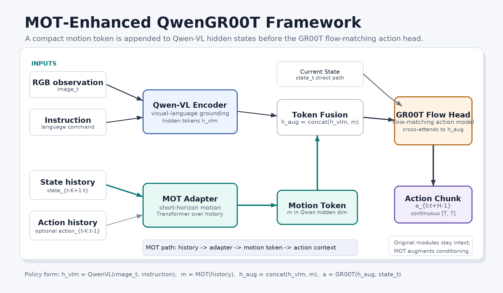

# MOT and RLINF Design Notes

This note explains the design logic behind motion-oriented temporal conditioning
(MOT) and the planned RLINF-style reinforcement fine-tuning stage. The argument is
organized as a paper-method narrative: failure diagnosis, representation repair,
objective repair, implementation anchors, and the experiments needed to make the
claim credible.

## 1. Problem Setting and Failure Diagnosis

Our setting is CALVIN ABC-D: the policy is trained on environments A/B/C and
evaluated in the unseen D environment. Each rollout contains a chain of up to five
language instructions, so the metric is not only atomic skill success. A good
policy must finish the current instruction while leaving the scene in a state that
is still recoverable for later instructions.

The strong Qwen3.5-VL + GR00T baseline already solves many visually explicit
skills. In the 1000-sequence evaluation of the strong augmented checkpoint,
`open_drawer`, `turn_off_lightbulb`, `lift_red_block_table`, and
`move_slider_right` are much more stable than the pushing family. The weakest
skills concentrate around `push_pink_block_left`, `push_red_block_right`,
`push_blue_block_right`, and related push/rotate cases.

This pattern is important. The main problem is not language grounding failure.
The policy usually knows which object and direction are relevant. The failure
mode is progress estimation: from a single RGB frame and instantaneous state, a
block that is halfway pushed can look deceptively similar to a block that is
already far enough, and the correct next action depends on what happened during
the last few control steps. Failure videos show under-pushing, over-correction,
oscillation, and occasional direction flips.

The core requirement is therefore:

```text
The policy needs an explicit short-horizon motion signal, not only the current
image, instruction, and instantaneous proprioception.
```

## 2. Design Principle: Two Missing Signals

The diagnosis gives two separate missing signals.

| Missing signal | Symptom in rollout | Proposed repair | What it changes |
| --- | --- | --- | --- |
| Temporal observability | The policy cannot tell whether the object is still moving toward the commanded state. | MOT | The policy input representation. |
| Outcome-level optimization | The policy imitates locally plausible actions but does not directly optimize chain success. | RLINF-style RL | The training objective and data distribution. |

MOT and RLINF are complementary rather than competing fixes. MOT asks what
information the policy should receive at inference time. RLINF asks what feedback
the policy should optimize after behavior cloning is saturated.

The simplest interface summary is:

| Method | Connected to | Input | Output | Downstream consumer |
| --- | --- | --- | --- | --- |
| MOT | Inside `QwenGR00T`, between Qwen-VL hidden states and the GR00T action head | Recent `state_history` and optional `action_history` | One or more motion tokens in the Qwen hidden dimension | GR00T flow-matching action head cross-attention |
| RLINF | Outside the model, around the environment rollout and policy update loop | Current VLA policy, CALVIN observations/instructions, executed actions, rewards | Updated policy checkpoint and rollout statistics | The same StarVLA evaluation/inference stack |

So MOT is a model-side conditioning module. RLINF is a training-side optimization
loop. MOT changes what the action head sees. RLINF changes how the policy is
updated after interacting with the environment.

## 3. MOT: Representation Repair

MOT adds a compact motion token before the GR00T action head. It is deliberately
small: we avoid replacing the VLM with a recurrent video model, and we avoid
forcing the flow-matching action head to rediscover temporal progress from raw
single-frame features. The VLM still handles object, scene, and language
semantics. The GR00T head still predicts continuous action chunks. MOT only
injects recent state/action dynamics as extra conditioning tokens.

Concrete connection point:

```text
image + instruction
  -> Qwen-VL
  -> hidden states h_vlm

state_history/action_history
  -> MOT adapter
  -> motion token m

concat(h_vlm, m)
  -> GR00T flow-matching action head
  -> action chunk
```

MOT does not replace Qwen-VL, the language prompt, or the GR00T action head. It
adds an extra token-level condition to the sequence that the action head already
attends to.

### 3.1 MOT-Enhanced Framework

After adding MOT, the framework becomes a temporally conditioned VLA policy:



```text
                         Language instruction
                                  |
                                  v
RGB observation  ---------->  Qwen-VL encoder  ----------------+
                                  |                            |
                                  v                            |
                         visual-language tokens h_vlm          |
                                                               |
Robot state history  ---->  MOT adapter  ---->  motion token --+
Optional action history             |
                                    v
                         temporal progress summary
                                                               |
                                                               v
                 concat(h_vlm, motion token) as action context
                                                               |
Current robot state  ------------------------------------------+
                                                               |
                                                               v
                         GR00T flow-matching action head
                                                               |
                                                               v
                         continuous action chunk [T, 7]
```

In module form:

| Block | Input | Output | Purpose |
| --- | --- | --- | --- |
| Qwen-VL encoder | RGB image and language instruction | Visual-language hidden tokens `h_vlm` | Object, scene, and instruction grounding. |
| MOT adapter | `state_history` and optional `action_history` | Motion token `m` in Qwen hidden dimension | Short-horizon progress and direction awareness. |
| Token fusion | `h_vlm` and `m` | Augmented context `h_aug = concat(h_vlm, m)` | Exposes motion evidence to the action head. |
| GR00T action head | `h_aug` plus current state when enabled | Continuous action chunk | Predicts future robot actions with flow matching. |

The resulting policy can be written compactly as:

```text
h_vlm = QwenVL(image_t, instruction)
m     = MOT(state_{t-K+1:t}, action_{t-K:t-1})
h_aug = concat(h_vlm, m)
a_{t:t+H-1} = GR00T(h_aug, state_t)
```

The key difference from the original QwenGR00T framework is the new middle path:

```text
history -> MOT adapter -> motion token -> action-head context
```

Everything else remains compatible with the original StarVLA training and
evaluation stack.

Implementation anchors:

| Component | File | Role |
| --- | --- | --- |
| MOT module | `starVLA/model/framework/VLM4A/QwenGR00T.py` | `MotionTokenAdapter` projects history into one or more motion tokens. |
| Token insertion | `starVLA/model/framework/VLM4A/QwenGR00T.py` | `_append_motion_tokens` concatenates MOT tokens to Qwen hidden states before action-head cross-attention. |
| Inference cache | `starVLA/model/framework/VLM4A/QwenGR00T.py` | `reset_motion_cache`, `_cached_motion_history`, and `_update_action_cache` maintain rollout history. |
| Dataset history | `starVLA/dataloader/gr00t_lerobot/datasets.py` | `_pack_sample` emits `state_history` and optional `action_history`. |
| Main MOT run | `examples/calvin/train_files/run_calvin_train_qwen35_gr00t_mot_state_adapter_from_strong_aug.sh` | State-history MOT with original state path preserved. |
| Adapter-only run | `examples/calvin/train_files/run_calvin_train_qwen35_gr00t_from_strong_aug_1000_mot_adapter_only.sh` | Diagnostic variant that freezes Qwen/action model and trains the new adapter. |

### 3.2 MOT Data Path

At training time, the data loader optionally emits:

| Field | Shape convention | Source | Used by |
| --- | --- | --- | --- |
| `state` | `[T_state, D_state]` after packing; consumed as batch tensor | Current sample proprio/state | GR00T action head when `pass_state_to_action_head=true` |
| `state_history` | `[K, D_state]` | Previous `K` states, including current step | MOT state branch |
| `action_history` | `[K, D_action]` | First `K` actions in the sampled window, when enabled | MOT action branch |
| `action` | `[T_action, D_action]` | Supervised action chunk | Flow-matching training target |

The current main route uses state history only:

```text
datasets.vla_data.include_state = true
datasets.vla_data.include_motion_history = true
datasets.vla_data.include_action_history = false
datasets.vla_data.motion_history_window = 4
framework.motion_adapter.use_state = true
framework.motion_adapter.use_action = false
framework.motion_adapter.pass_state_to_action_head = true
```

This route is intentionally conservative. The strong baseline already benefits
from state-conditioned action prediction, so we keep that path active and add MOT
as an auxiliary temporal signal. The earlier adapter-only variant with
`pass_state_to_action_head=false` is useful as an ablation, but it is brittle as
the main method because the new adapter must recover both instantaneous state
conditioning and temporal progress.

MOT input/output contract:

| Item | Contract |
| --- | --- |
| Input `state_history` | Tensor-like history of recent states, truncated or padded to `history_window` and `state_dim`. |
| Optional input `action_history` | Tensor-like history of recent actions, truncated or padded to `history_window` and `action_dim`. |
| Output `motion_tokens` | Tensor with shape `[B, num_motion_tokens, qwen_hidden_dim]`. |
| Insertion point | Concatenated to `last_hidden` from Qwen-VL along the sequence dimension. |
| Final consumer | `self.action_model(last_hidden_with_motion, actions_target, state_repeated)` during training, and `predict_action(last_hidden_with_motion, state)` during inference. |

### 3.3 MOT Architecture

`MotionTokenAdapter` implements the following computation:

```text
state_history/action_history
  -> dimension match or zero-pad to configured state/action dim
  -> linear projection to hidden_dim
  -> add type embedding and temporal position embedding
  -> lightweight Transformer encoder
  -> mean pooling plus learnable motion query
  -> LayerNorm + Linear projection to Qwen hidden dimension
  -> concatenate to Qwen hidden sequence
  -> GR00T flow-matching action head cross-attention
```

Key hyperparameters:

| Hyperparameter | Current value | Reason |
| --- | ---: | --- |
| `history_window` | 4 | Captures short motion trends without making the adapter responsible for long-term memory. |
| `hidden_dim` | 512 | Large enough for state/action interactions, small relative to the VLM. |
| `num_layers` | 2 | Keeps the temporal encoder lightweight and stable from a new initialization. |
| `num_heads` | 8 | Standard multi-head split for 512 hidden units. |
| `dropout` | 0.1 | Regularizes the new adapter during fine-tuning. |
| `num_motion_tokens` | 1 by default | A single summary token minimizes perturbation to the action head. |
| `state_dim` | 8 in the CALVIN MOT run | Matches the packed proprio/state convention used by the current script. |
| `action_dim` | 7 | CALVIN delta action dimension. |
| `motion_adapter` LR | `1.0e-4` | Newly initialized module should learn faster than pretrained policy parts. |
| `base/action_model` LR | `2.0e-5` in the state-adapter route | Keeps the strong supervised policy from drifting too quickly. |

### 3.4 Why Token Injection Instead of Recurrent Images?

| Option | Benefit | Risk | Decision |
| --- | --- | --- | --- |
| Stack image frames into VLM | Rich visual motion signal | Expensive, changes VLM input distribution, harder to train. | Not first choice. |
| Add recurrent action head | Direct temporal state | Larger architectural change and checkpoint compatibility risk. | Deferred. |
| Add MOT token | Minimal surface area, preserves VLM/action-head interface, easy to ablate. | Only captures compact history, not full visual dynamics. | Current method. |

The chosen design gives the model the missing progress signal while keeping the
baseline mostly intact. This is the right tradeoff for a high-confidence
increment over a strong checkpoint.

### 3.5 MOT Pseudocode

The core MOT logic is intentionally short:

```text
Input:
  image_t, instruction, state_t
  state_history = [state_{t-K+1}, ..., state_t]
  optional action_history = [action_{t-K}, ..., action_{t-1}]

VLM tokens:
  h_vlm = QwenVL(image_t, instruction)

Motion token:
  z_state  = LinearState(state_history) + state_type + pos_embed
  z_action = LinearAction(action_history) + action_type + pos_embed
  z_motion = TransformerEncoder(concat(z_state, z_action))
  m = Project(mean_pool(z_motion) + motion_query)

Action prediction:
  h = concat(h_vlm, m)
  action_chunk = GR00T_FlowHead(h, state_t)
```

For the current state-history route, `z_action` is omitted and the original
`state_t -> GR00T_FlowHead` path is kept active.

## 4. MOT Training Protocol

The primary MOT run starts from:

```text
results/Checkpoints/qwen35vl4b_gr00t_calvin_abc_d_strong_aug/checkpoints/steps_30000_pytorch_model.pt
```

and writes:

```text
results/Checkpoints/qwen35vl4b_gr00t_calvin_abc_d_strong_aug_steps30000_mot_state_adapter
```

Training configuration:

| Group | Setting |
| --- | --- |
| Framework | `QwenGR00T` |
| Base VLM | `/inspire/qb-ilm2/project/26summer-camp-10/public/two/Model/Qwen3.5-4B` |
| Data mix | `calvin_task_ABC_D` |
| Per-device batch size | 8 |
| Frozen modules | `qwen_vl_interface` |
| Trainable modules | MOT adapter and GR00T action head |
| Max train steps | 50,000 |
| Save interval | 5,000 |
| Eval interval | 250 |
| Video backend | `torchvision_av` |
| Adapter LR | `1.0e-4` |
| Base/action LR | `2.0e-5` |

The intended training interpretation is targeted repair:

1. Preserve the strong augmented model's visual-language grounding.
2. Preserve the useful instantaneous state path.
3. Let MOT learn short-horizon state dynamics.
4. Let the action head adapt to the new motion token without forcing a full VLM
   update.

## 5. MOT Claims and Required Ablations

The paper-level claim should not be "MOT is generally better" unless the
evidence supports it. The precise claim is:

```text
Short-horizon motion tokens improve progress-sensitive manipulation skills,
especially push/rotate/slider tasks, while preserving performance on visually
explicit skills.
```

Required ablations:

| Experiment | Purpose | Expected diagnostic |
| --- | --- | --- |
| Strong augmented baseline | Reference policy | Establish 1000-sequence chain success and task-level skill profile. |
| MOT state-history, state path preserved | Main method | Should improve push/rotate/slider without regressing easy skills. |
| MOT adapter-only, state path disabled | Tests whether MOT can replace direct state conditioning | Likely brittle; useful negative/diagnostic evidence. |
| History window `K=1,2,4,8` | Separates temporal benefit from parameter-count benefit | `K=1` should behave close to state-only; `K=4` should be a good cost/benefit point. |
| State-only vs action-only vs state+action MOT | Identifies which history source carries useful progress | State-only is safest; action history may help recovery but can amplify self-generated errors. |
| Freeze action head vs tune action head | Tests whether cross-attention must adapt to MOT token | Tuning action head should usually be more effective. |

Reporting should include both aggregate chain metrics and task-family metrics.
For the current reference baseline:

```text
Average successful sequence length: 2.380
1/5: 77.3%
2/5: 57.5%
3/5: 44.5%
4/5: 34.2%
5/5: 24.5%
```

The task-level table should group at least:

| Family | Example tasks | Why it matters |
| --- | --- | --- |
| Push | `push_pink_block_left`, `push_red_block_right`, `push_blue_block_right` | Primary target of progress-awareness repair. |
| Rotate | `rotate_*_block_left/right` | Direction and accumulated pose matter. |
| Slider | `move_slider_left/right`, `place_in_slider` | Tests continuous progress and endpoint precision. |
| Drawer/light | `open_drawer`, `turn_on_lightbulb` | Regression guard for visually explicit skills. |
| Lift/place/stack | `lift_*`, `place_*`, `stack_block` | Tests whether MOT helps or hurts contact-rich multi-step behavior. |

## 6. Why MOT Alone Is Not Enough

MOT improves observability, but it is still trained mainly through behavior
cloning. Behavior cloning optimizes local action matching under demonstration
states. CALVIN ABC-D evaluates long-horizon execution under the model's own
state distribution. These are different distributions.

A rollout can contain many locally plausible actions and still fail because:

1. A block is pushed slightly short and the next instruction starts from a bad
   pose.
2. The model enters an off-demonstration state and keeps repeating a locally
   reasonable but globally ineffective correction.
3. Small early drift accumulates across a five-instruction chain.
4. The supervised loss does not know that one small action error caused a later
   chain failure.

This motivates RLINF-style training: keep the supervised VLA checkpoint as a
strong initialization, then optimize actual rollout outcomes.

## 7. RLINF: Objective Repair

RLINF is the planned reinforcement fine-tuning infrastructure for the VLA policy.
The relevant principle from RLinf-VLA is the unified VLA+RL loop: roll out a
language-conditioned action policy in simulation, collect environment feedback,
and update the policy with RL algorithms such as PPO or GRPO. RLinf also provides
standardized interfaces for VLA models, simulators, rollout workers, and actor
training, which is the part we want to map onto CALVIN.

Concrete connection point:

```text
CALVIN environment
  -> observation + instruction
  -> StarVLA policy, optionally with MOT
  -> action chunk
  -> execute action(s) in environment
  -> success/progress reward
  -> RLINF policy update
  -> new StarVLA checkpoint
```

RLINF does not add a new inference-time input token by itself. It wraps the
policy in a rollout-and-update system. The model architecture can remain the same
as QwenGR00T or QwenGR00T+MOT; the difference is that training now uses rewards
from the model's own rollouts.

For StarVLA, the RLinf documentation defines a useful wrapper convention:
`env_obs` is batch-first and contains RGB images, states, and task descriptions;
the policy outputs an action chunk `[B, T, D_action]`, usually executed in a
receding-horizon loop. This matches our GR00T-style policy shape closely enough
to make integration feasible.

RLINF input/output contract:

| Item | Contract |
| --- | --- |
| Policy input | Same inference input as StarVLA: image observation, language instruction, state, and MOT history if enabled. |
| Policy output | Continuous action chunk, e.g. `normalized_actions` with shape `[B, T, 7]`. |
| Environment output | Next observation, task success flag, optional progress measurements, and termination info. |
| RL reward | Scalar per step or per subtask, derived from success/progress/safety terms. |
| RL update output | Updated policy parameters plus rollout logs, reward curves, and evaluation metrics. |
| Final artifact | A checkpoint evaluated by the normal CALVIN 1000-sequence protocol. |

### 7.1 CALVIN-to-RLINF Interface Mapping

| RLINF concept | CALVIN / StarVLA mapping |
| --- | --- |
| `main_images` | Static camera RGB frame, resized consistently with training. |
| `wrist_images` / extra views | Optional CALVIN camera streams if enabled. |
| `states` | CALVIN robot proprio/state, with explicit 7-D or 8-D convention. |
| `task_descriptions` | Current natural-language subtask instruction. |
| Actor model | `QwenGR00T` checkpoint, preferably strong augmented + validated MOT. |
| Action chunk | GR00T predicted `normalized_actions`, shape `[B, T, 7]`. |
| Action execution | Receding horizon: execute first `N` actions, then replan. |
| Reward source | CALVIN subtask success plus optional progress rewards. |
| Eval protocol | Same 1000-sequence ABC-D split used by supervised experiments. |

### 7.2 Candidate Reward Design

Reward design must be strong enough to learn from failures but not so shaped
that it teaches shortcuts. The recommended staged design is:

| Reward term | Definition | Use |
| --- | --- | --- |
| `R_success` | `+1` when the current subtask succeeds | Clean sparse objective; should always be logged. |
| `R_chain` | Bonus for each additional completed instruction in the 5-step chain | Aligns with official sequence metric. |
| `R_progress_push` | Signed block displacement along commanded direction | Dense signal for the known weak family. |
| `R_progress_slider` | Slider displacement toward target side | Dense signal for endpoint progress. |
| `R_progress_drawer` | Drawer joint progress toward open/close target | Regression and shaping sanity check. |
| `R_safety` | Penalty for excessive action norm, repeated oscillation, or invalid state | Prevents reward hacking through unstable actions. |
| `R_bc_kl` / imitation regularizer | Penalize moving too far from the supervised policy | Stabilizes early RL from a strong checkpoint. |

The first RL run should start simple: sparse success plus light KL/BC
regularization. Dense progress terms should be added only when logs show the
sparse reward is too slow or unstable.

### 7.3 RL Training Stages

| Stage | Initialization | Trainable modules | Goal |
| --- | --- | --- | --- |
| S0: supervised baseline | Strong augmented QwenGR00T | Existing supervised recipe | Establish robust language/vision/action prior. |
| S1: MOT repair | S0 checkpoint | MOT adapter + action head, Qwen frozen | Improve temporal observability. |
| S2: RL warm start | Best S1 checkpoint | Action head and MOT adapter; Qwen frozen | Improve task success without destabilizing VLM. |
| S3: selective unfreeze | Best S2 checkpoint | Optional LoRA or limited VLM modules | Only if S2 saturates and failure analysis shows perception-language adaptation is needed. |

The main reason to put RLINF after MOT is stability. RL should not be asked to
discover both temporal representation and rollout-level objective from scratch.
Starting from a temporally aware policy reduces exploration waste and makes
reward learning focus on success and recovery.

### 7.4 RLINF Pseudocode

The intended RL loop is:

```text
policy = load_checkpoint(best_supervised_or_MOT_checkpoint)
reference_policy = frozen_copy(policy)

for iteration in RL_iterations:
  trajectories = []

  for env in rollout_workers:
    obs, instruction = env.reset()
    policy.reset_motion_cache()

    while not done:
      action_chunk = policy.predict_action(obs, instruction, step=t)
      action = first_action_or_short_horizon(action_chunk)
      next_obs, success, info = env.step(action)

      reward = R_success(success)
             + R_progress(obs, next_obs, instruction)
             - R_safety(action, info)

      trajectories.append(obs, instruction, action, reward, next_obs)
      obs = next_obs

  advantage = estimate_advantage(trajectories)
  loss = RL_surrogate(policy, trajectories, advantage)
       + beta * KL_or_BC(policy, reference_policy, trajectories)

  update(policy, loss)
  evaluate_on_1000_sequence_ABC_D(policy)
```

This pseudocode hides the PPO/GRPO/πRL-specific details on purpose. The invariant
is the important part: roll out the current VLA policy, reward actual task
progress, and regularize against the strong supervised policy.

### 7.5 Flow-Matching Action Head Consideration

Our GR00T head is flow-matching based, so RL fine-tuning needs a policy objective
that can handle continuous action chunks and, ideally, a tractable policy-ratio
or surrogate. The πRL line is relevant because it targets RL fine-tuning for
flow-based VLA models, where action log-likelihood is not trivial. Its two
high-level ideas, Flow-Noise and Flow-SDE, are useful references for how to turn
flow denoising into an RL-compatible object. For our implementation plan, the
immediate practical options are:

| Option | Pros | Cons |
| --- | --- | --- |
| GRPO/PPO through RLinf StarVLA wrapper with action chunks | Directly aligned with RLinf's VLA workflow | Need to confirm exact log-prob support for QwenGR00T flow head. |
| Add a lightweight Gaussian residual head for RL | Easy likelihood and stable KL to BC policy | Adds another action distribution layer. |
| πRL-style flow objective | Best conceptual match to flow-based actions | More implementation work; should follow RLinf/πRL code closely. |

The paper claim should phrase this carefully: RLINF is the infrastructure and
training principle; the exact flow-compatible policy objective is an engineering
choice to validate before large-scale training.

## 8. Combined Hypothesis

The combined MOT + RLINF hypothesis is:

```text
MOT improves the policy's observability.
RLINF improves the policy's objective and recovery distribution.
Together they should reduce progress-related failures and improve long-chain
success, especially from 3/5 to 5/5 sequence completion.
```

Expected qualitative changes:

| Failure before | Expected behavior after MOT | Expected behavior after MOT + RLINF |
| --- | --- | --- |
| Under-push and stop early | Better estimate that object displacement is insufficient | Continue or correct because success reward favors completion. |
| Direction flip after partial progress | More stable short-horizon direction estimate | Penalize rollouts that undo progress. |
| Oscillation near endpoint | History token exposes repeated ineffective motion | RL discourages action cycles that do not improve success. |
| Chain failure after small early drift | Less drift in progress-sensitive subtasks | Learn recovery from off-demonstration states. |

## 9. Evaluation Protocol and Acceptance Criteria

All major claims should use the full 1000-sequence evaluation, not short samples.
The aggregator in `examples/calvin/eval_files/aggregate_calvin_results.py`
already merges worker JSONs into:

| Metric | Meaning |
| --- | --- |
| `avg_seq_len` | Average number of successful subtasks per 5-step chain. |
| `chain_sr[1..5]` | Fraction of sequences reaching at least each chain length. |
| `task_info[*].sr` | Per-task success rate. |

Minimum acceptance criteria for the MOT stage:

1. No major regression on 1/5 and visually explicit task families.
2. Positive movement on push/rotate/slider task success.
3. Improvement in `avg_seq_len` or late-chain rates, especially 3/5 through 5/5.
4. Stable inference with matching `state_dim`, `action_dim`, and
   `pass_state_to_action_head` settings.

Minimum acceptance criteria for the RLINF stage:

1. Improves official chain metrics over the best supervised + MOT checkpoint.
2. Does not gain only by overfitting one easy skill family.
3. Shows qualitative recovery from off-demonstration states in rollout videos.
4. Maintains action smoothness and avoids reward-shaped oscillation.

## 10. Practical Risks and Checks

| Risk | Why it matters | Check |
| --- | --- | --- |
| State dimension mismatch | 7-D vs 8-D state conventions can silently degrade or crash MOT/action head. | Log state shape at training and inference; match checkpoint config. |
| Training/inference history mismatch | MOT trained with `state_history` but evaluated without cache/history will lose its signal. | Verify `predict_action(step=0)` resets cache and subsequent calls update history. |
| Adapter-only brittleness | Removing direct state path makes the new module relearn baseline conditioning. | Treat adapter-only as ablation, not default. |
| Action history feedback loop | Predicted actions can encode previous model errors. | Compare state-only, action-only, and state+action variants. |
| RL reward hacking | Dense progress rewards can optimize proxy behavior. | Always report sparse success and task-family metrics. |
| RL policy drift | RL can destroy a strong BC prior. | Use KL/BC regularization and freeze Qwen first. |

## 11. Best-Paper-Level Framing

The strongest story is not "we added an adapter and then RL." The stronger story
is a two-axis correction for long-horizon VLA manipulation:

1. **Representation axis:** CALVIN push/rotate failures expose missing temporal
   observability in single-frame VLA policies. MOT repairs this with a small,
   checkpoint-compatible motion token.
2. **Objective axis:** BC optimizes action imitation under demonstration states,
   while ABC-D evaluates success under self-induced states. RLINF repairs this by
   optimizing rollout outcomes and recovery.
3. **Systems axis:** The method stays modular inside StarVLA: the VLM, data
   loader, GR00T action head, evaluation scripts, and future RLINF wrapper remain
   separable. This makes ablations clean and makes the result reproducible.

The final paper should make claims in this order:

| Claim | Evidence needed |
| --- | --- |
| Failure is progress-related, not only language grounding. | Task-family breakdown and representative rollout videos. |
| MOT supplies the missing temporal signal. | MOT ablations by history source/window and per-family gains. |
| RL is needed beyond MOT because BC has an objective mismatch. | Off-demonstration recovery examples and RL gains over best MOT checkpoint. |
| The combined approach improves long-horizon generalization. | Full 1000-sequence ABC-D metrics with 3/5, 4/5, 5/5 improvements. |

## 12. References and Anchors

Repository anchors:

- MOT implementation: `starVLA/model/framework/VLM4A/QwenGR00T.py`
- Motion history data path: `starVLA/dataloader/gr00t_lerobot/datasets.py`
- MOT state-adapter training: `examples/calvin/train_files/run_calvin_train_qwen35_gr00t_mot_state_adapter_from_strong_aug.sh`
- MOT adapter-only training: `examples/calvin/train_files/run_calvin_train_qwen35_gr00t_from_strong_aug_1000_mot_adapter_only.sh`
- Strong augmentation run: `examples/calvin/train_files/run_calvin_train_qwen35_gr00t_strong_aug.sh`
- CALVIN result aggregation: `examples/calvin/eval_files/aggregate_calvin_results.py`
- CALVIN project report: `docs/CALVIN_ABC_D_REPORT.md`

External references:

- RLinf-VLA: A Unified and Efficient Framework for Reinforcement Learning of Vision-Language-Action Models, arXiv 2510.06710: https://arxiv.org/abs/2510.06710
- RLinf documentation: https://rlinf.readthedocs.io/
- RLinf StarVLA embodied example: https://rlinf.readthedocs.io/zh-cn/latest/rst_source/examples/embodied/starvla.html
- πRL: Online RL Fine-tuning for Flow-based Vision-Language-Action Models, arXiv 2510.25889: https://arxiv.org/abs/2510.25889
- RLinf πRL documentation: https://rlinf.readthedocs.io/en/release-v0.2/rst_source/publications/pi_rl.html

The important connection to our work is conceptual and practical: use supervised
VLA training to obtain a capable initial policy, use MOT to repair temporal
observability, and use RLINF-style rollout optimization to directly target task
success and recovery from failure states.
